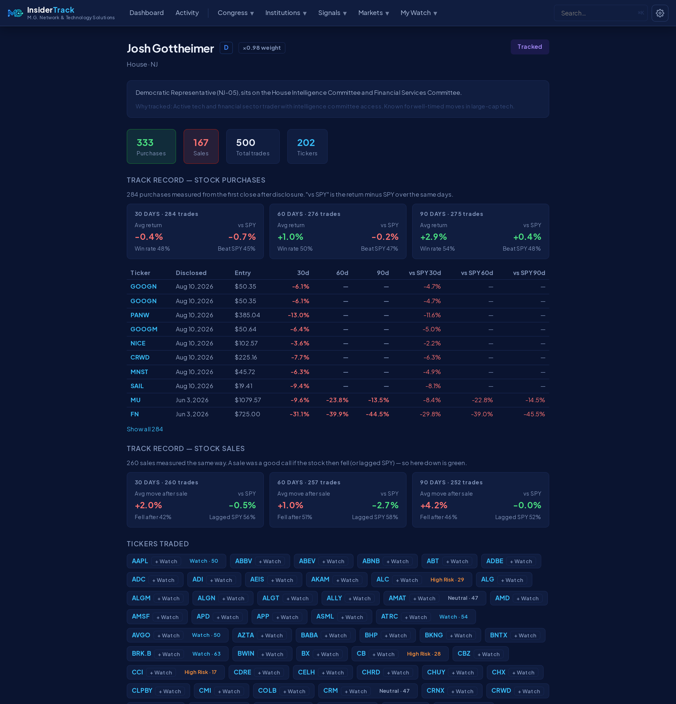
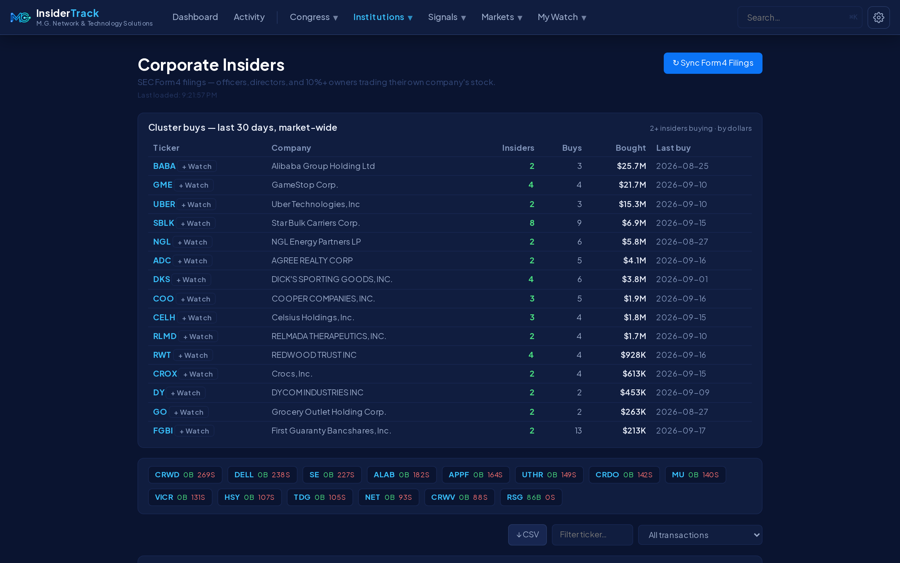
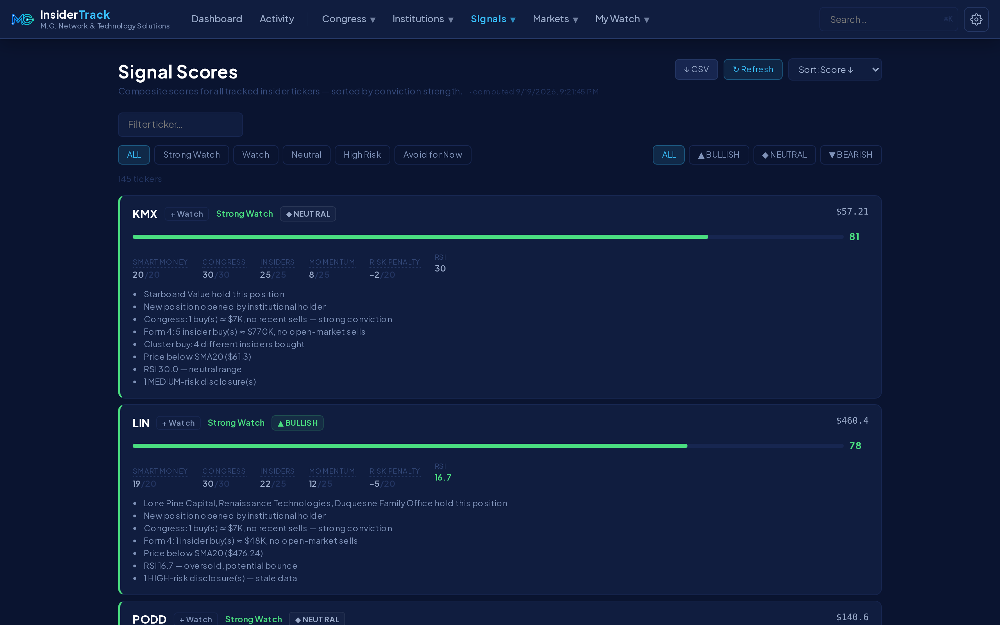
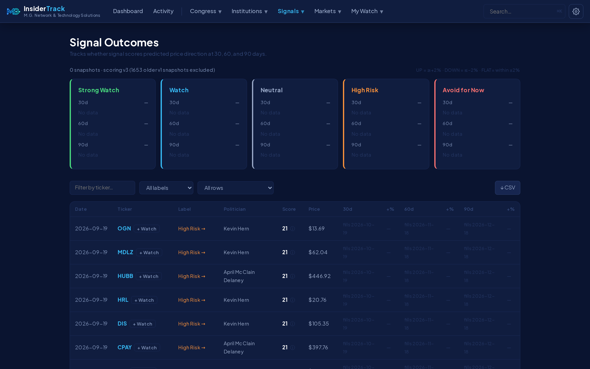
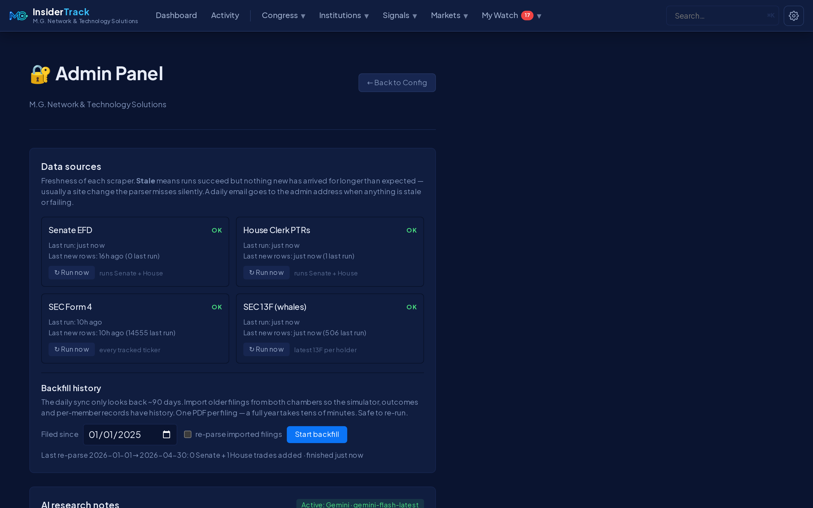
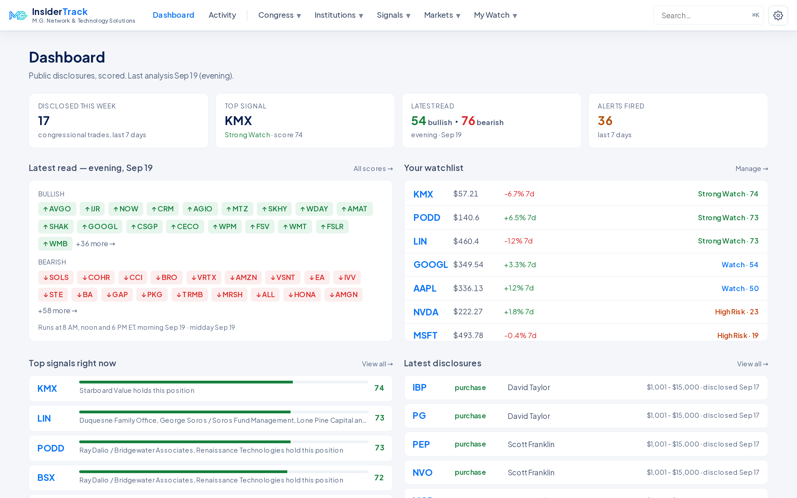
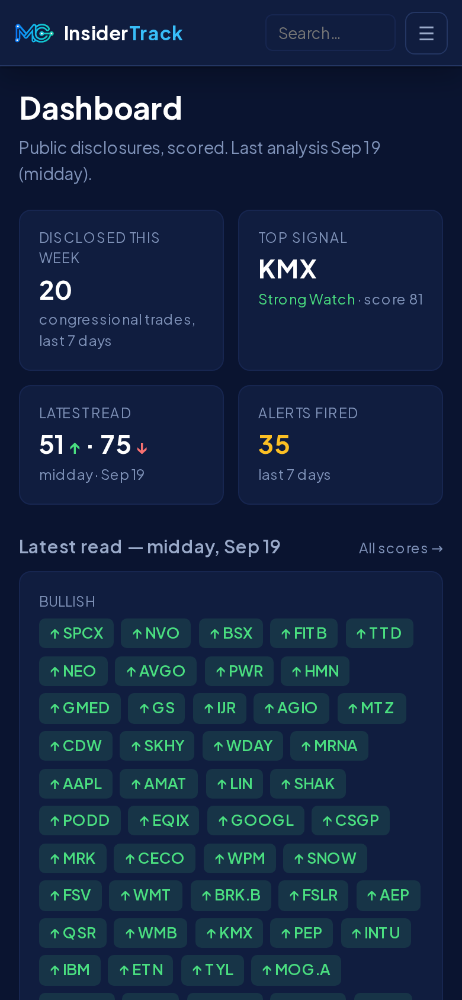
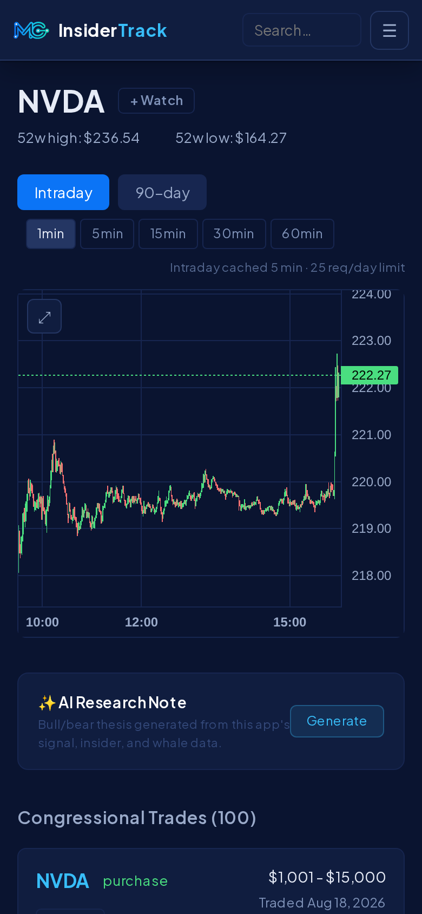

# InsiderTrack

[](https://github.com/mrgutierrezmario/insidertrack/releases)
[](https://github.com/mrgutierrezmario/insidertrack/actions/workflows/ci.yml)
[](LICENSE)
[](app/ui_backend)
[](app/ui_backend)
[](app/ui_frontend)
[](app/ui_frontend)
[](deploy)

Track the stock trades of U.S. Congress members, corporate insiders and
institutional investors from their legally required public disclosures — then
score each ticker on who is buying, weight each member by how their past buys
actually did, and get alerts when something moves. Everything runs on your
own machine from free public data sources; cloud AI providers are optional.

**By M.G. Network and Technology Solutions.**


<p align="center"><em>The Dashboard: what changed this week, the top signal, the latest read, your watchlist with each ticker's score. Dark mode; light mode below.</em></p>

| | |
|---|---|
| Congress | Every electronic House and Senate periodic transaction report, straight from the Clerk and the EFD — owner (member / spouse / child / joint), asset kind, dollar bracket, and a **direction** that treats a put purchase as the bearish bet it is. Amendments reconciled; scanned paper filings read by a vision model |
| Corporate insiders | SEC Form 4, per ticker and **market-wide daily** — with a cluster-buys view (2+ insiders buying their own stock) |
| Institutions | Quarterly 13F holdings of 21 discretionary managers, new/increased/reduced/closed per quarter |
| Score | 0–100 per ticker: smart money + Congress (dollar-weighted, scaled by each member's track record) + corporate insiders + momentum − staleness |
| Track record | Every member's stock buys — and sales — measured at 30/60/90 days vs SPY; win rate, average excess, and the weight it earns them in the score. A **Leaderboard** ranks members by how often their buys beat the market |
| Outcomes | Daily snapshots of every score, filled at 30/60/90 days, so the hit-rate of each label is a number rather than a claim |
| Also | Alerts (rules + digest email), investment simulator vs SPY, watchlist and email reports, earnings calendar, AI research notes per ticker (site key or bring your own) |
| Runs as | A Docker Compose stack (Postgres, app, Tailscale sidecar) with a fixed public HTTPS URL via Tailscale Funnel — free, no domain needed |
| Docs in the app | `/guide` (how to read every page and the score) and `/privacy` (exactly what the site stores about a visitor), linked from Settings and the phone menu |
| Operations | Per-source scraper health with a daily notice when a government site changes under you; encrypted off-site backups with a scripted restore; CI on every push; Dependabot; [`deploy/OPERATIONS.md`](deploy/OPERATIONS.md) is the operator's to-do list |

<details>
<summary><strong>More screenshots</strong> — track record, cluster buys, signals, outcomes, admin, light mode, phone</summary>

<br>


<p align="center"><em>A member's track record: every stock buy measured from the first close after disclosure, against SPY. The "×0.98 weight" badge is what those results earn their trades in the score.</em></p>


<p align="center"><em>Cluster buys, market-wide: several insiders putting their own money into the same stock in the same month — including companies no member of Congress traded.</em></p>


<p align="center"><em>Signals: the composite score and the four sub-scores behind it, with the reasons written out.</em></p>


<p align="center"><em>Outcomes: does "Strong Watch" actually go up? Every score is snapshotted daily and checked at 30/60/90 days, per scoring version.</em></p>


<p align="center"><em>Admin → Data sources: scraper freshness, Run now per source, backfill and re-parse.</em></p>


<p align="center"><em>Light mode.</em></p>

<p align="center"> </p>
<p align="center"><em>On a phone: the Dashboard and a ticker page.</em></p>

</details>

---

## Contents

- [Prerequisites](#prerequisites)
- [Quick Start](#quick-start)
- [Production (Docker + Tailscale Funnel)](#production-docker--tailscale-funnel)
- [First Use](#first-use)
- [Configuring API Keys](#configuring-api-keys)
- [Data Sources](#data-sources)
- [How Signals Work](#how-signals-work)
- [Daily Schedule](#daily-schedule)
- [Project Structure](#project-structure)
- [Security](#security)
- [Logs](#logs)
- [Versions and releases](#versions-and-releases)
- [Contributing](#contributing)
- [How it was built](#how-it-was-built)
- [Disclaimer](#disclaimer)
- [License](#license)

---

## Prerequisites

| Tool | Minimum version | Install |
|---|---|---|
| Docker Desktop | any recent | https://www.docker.com/products/docker-desktop |
| Python | 3.11+ | https://www.python.org |
| Node.js | 18+ | https://nodejs.org |

---

## Quick Start

```bash
git clone https://github.com/mrgutierrezmario/insidertrack.git
cd insidertrack
bash start.sh
```

The script will:
1. Start PostgreSQL in Docker (or use a local install if available)
2. Install Python packages
3. Install Node packages (first run only)
4. Build the frontend
5. Start the backend on port 8003 (which also serves the built frontend)

Press **Ctrl+C** to shut everything down cleanly.

| Service | URL |
|---|---|
| App | http://localhost:8003 |
| API docs | http://localhost:8003/docs |
| Database | localhost:5433 (Docker) or 5432 (local) |

---

## Production (Docker + Tailscale Funnel)

`start.sh` above is the development loop. The always-on deployment is a
self-contained Docker stack in `deploy/` — the same shape as the
lecture-note-app: Postgres 18 + a Tailscale sidecar that publishes the app on a
fixed HTTPS URL via Funnel, with the app sharing the sidecar's network
namespace.

```bash
deploy/start.sh    # build/update + start everything (safe to re-run)
deploy/stop.sh     # stop; data is kept in Docker volumes
docker compose -f deploy/compose.yml logs -f app
```

- Config lives in `deploy/.env` (git-ignored; created from `deploy/.env.example`
  with generated secrets on first run). Set `TS_HOSTNAME` and `PUBLIC_DOMAIN`
  to `<TS_HOSTNAME>.<your tailnet>.ts.net`.
- First run: the stack asks for a one-time Tailscale sign-in (or set
  `TS_AUTHKEY`). If the database is empty and `deploy/state/` contains a
  `*.dump` (pg_dump custom format), the newest one is restored automatically.
- Local access without Funnel: `http://localhost:${APP_PORT}` (default 8013).
- The app's own nightly `pg_dump` (04:00 ET, last 7 kept) lands in the `backups`
  volume: `docker compose -f deploy/compose.yml exec app ls /backups`. That
  copy dies with the Docker host, so there is also a **host-side, off-site
  backup**:

  ```bash
  deploy/backup-setup.sh   # once, on the Mac: rclone + encrypted Google Drive folder + nightly launchd job
  deploy/backup.sh         # any time: DB dump + .env + Tailscale identity → deploy/state/backups, synced off-site
  deploy/restore.sh --from-remote latest   # new machine: pull the off-site copy and rebuild the stack (same URL)
  ```

  Backups are encrypted before they leave the machine (rclone crypt); the
  passphrase is printed once by the setup script — keep it in a password
  manager. Uses its own Google account / rclone remote (`gdrive-stock-tracker`),
  separate from the lecture-notes backups. Failures email `MAIL_ADMIN_TO`.
- If the Tailscale container restarts, the app notices within ~45 s that its
  network namespace is gone and restarts itself onto the new one.

## First Use

1. Open http://localhost:8003
2. Sign in to **Admin** (gear icon → Admin) and click **⟳ Sync** on the Dashboard — pulls the last ~90 days of House and Senate filings straight from the Clerk and the EFD (a few minutes; one PDF per filing)
3. Optionally **Admin → Data sources → Backfill history** to import older filings (a full year takes tens of minutes; safe to re-run)
4. Signals appear once the sync completes — every member with a filed disclosure is tracked by default; mute anyone on the Politicians page to keep them out of signals and alerts
5. **Settings** → set your watchlist email to receive reports and personalize the earnings calendar
6. **Admin** → optional API keys (AI provider, Alpha Vantage, mail)

---

## Configuring API Keys

Optional keys unlock additional features. Set them in the Admin panel (no restart needed) or in `app/ui_backend/.env`:

| Key | Feature | Where to get it |
|---|---|---|
| `ALPHA_VANTAGE_KEY` | Minute-by-minute intraday charts; news with sentiment labels (without it the News page shows Google News headlines) | alphavantage.co — free tier: 25 req/day |
| `ANTHROPIC_API_KEY` / `GEMINI_API_KEY` / `OPENAI_API_KEY` | AI bull/bear research notes on ticker pages. `AI_PROVIDER` picks the writer (claude / gemini / openai); other configured providers are fallbacks. Visitors can also bring their own key in Settings | console.anthropic.com / aistudio.google.com / platform.openai.com — cached 6h per ticker |
| `MAIL_USERNAME` + `MAIL_PASSWORD` | Email reports, alert notifications, data-source notices | Gmail address + App Password (myaccount.google.com/apppasswords) |
| `MAIL_ADMIN_TO` | Where operational notices go (a scraper failing or gone quiet). Defaults to the sender | — |

Keys set via the Admin UI are stored in the database and take effect immediately.

---

## Data Sources

### Congressional Trades
| Source | Update frequency | Lag |
|---|---|---|
| House Clerk — Periodic Transaction Report PDFs (disclosures-clerk.house.gov) | Daily, rolling 90-day window | Up to 45 days (STOCK Act deadline) |
| Senate EFD — electronic PTRs (efdsearch.senate.gov) | Daily, rolling 90-day window | Up to 45 days (STOCK Act deadline) |

Only electronically-filed reports are parsed (scanned paper filings have no text layer). Amendments are reconciled in both chambers: a Senate amendment is a full re-filing and replaces the report it names; a House amendment re-files individual transactions under their 10-digit transaction ID and replaces those rows in place. Only the corrected version is ever shown (tagged AMENDED). Each row records the owner (member / spouse / dependent child / joint), the asset kind (stock / option / other), the disclosed dollar bracket, and a **direction** — the trade's bet on the ticker. Options follow their contract (long call / short put = bullish); an option whose filing doesn't say call or put, and bonds, are neutral and don't count toward the signal. Party and state come from the `unitedstates/congress-legislators` roster.

### Corporate Insiders (Form 4)
| Source | Update frequency | Lag |
|---|---|---|
| SEC EDGAR — per-ticker filing history for every ticker in the congressional universe (15 most recent Form 4s each; all transaction codes) | Daily 6:30 AM ET | 2 business days |
| SEC EDGAR daily form index — **every Form 4 filed, market-wide**; open-market buys and sells (codes P/S) only | Daily 6:30 AM ET, catches up any missed days | same day (evening index) |

The market-wide feed powers the **Cluster buys** table on the Insiders page — tickers where 2+ different insiders bought on the open market in the last 30 days — which covers companies no member of Congress traded. The composite score's Form 4 sub-score still reads only tickers in the congressional universe.

### Institutional Whales (13F)
| Source | Update frequency | Lag |
|---|---|---|
| SEC EDGAR | Quarterly | 45–60 days after quarter end |

Pre-loaded filers (21): Berkshire, Soros, Renaissance, Bridgewater, Pershing Square, Scion, ARK, Tiger Global, Duquesne, Appaloosa, Baupost, Third Point, Elliott, Coatue, Lone Pine, Viking, Greenlight, Trian, Starboard, Altimeter, Icahn. Discretionary managers only — quant/multi-strat shops hold thousands of hedged positions that say nothing about conviction. Add more in Admin → Filings institutions.

### Federal Reserve Officials
Roster only (seeded at startup, refreshable from the page). Board members have been barred from holding individual stocks since 2022, and OGE publishes disclosures as PDFs with no API, so the Fed page shows who is on the Board with an empty (compliant) trade list.

### Freshness monitoring
Every sync records its outcome per source. `GET /health` reports each source as `ok` / `stale` (runs succeed but no new rows for longer than expected — usually a site change the parser misses silently) / `failing` (three consecutive failures). **Admin → Data sources** shows the same, and a daily 9 AM ET job emails `MAIL_ADMIN_TO` only when something is stale or failing.

---

## How Signals Work

Every ticker with a congressional trade in the last 45 days gets a **composite score (0–100)** built from four sub-scores (scoring **v4**, since 2026-09-19):

| Component | Max points | What it measures |
|---|---|---|
| Smart money | 20 | Whale 13F activity for this ticker (new / increased / reduced / closed), each holder's position weighted by its share of that holder's book; a 5%+ position earns a conviction bonus. A holder's first loaded quarter is neutral |
| Congress | 30 | Congressional buys vs. sells (45-day window), weighted by the disclosed dollar bracket **and by the member's own track record** — ×0.5 to ×1.5 from their 90-day beat-SPY rate (×1 until 10 buys are measured; recomputed weekly). Options count by contract direction (long call / short put = bullish); unknown contracts and bonds are neutral |
| Corporate insiders | 25 | SEC Form 4 open-market buys vs. sells by officers, directors and 10% owners (90-day window), by dollar value. Buying counts more than selling; several insiders buying together earns a bonus |
| Momentum | 25 | SMA20/50 crossovers, RSI, price trend |
| Risk penalty | −20 | Stale disclosures (old trades or long disclosure lag) |

News sentiment (v1) was dropped: the Alpha Vantage free tier can't cover the ticker universe, so it scored every ticker an identical neutral value. Each outcome snapshot records its `score_version`; the Outcomes page only compares hit-rates within one version.

| Score range | Label |
|---|---|
| 70–100 | Strong Watch |
| 50–69 | Watch |
| 30–49 | Neutral |
| 15–29 | High Risk |
| 0–14 | Avoid for Now |

Signal outcomes are tracked at 30, 60, and 90 days — see the **Outcomes** page for historical hit rates.

---

## Daily Schedule

All times Eastern. Jobs run automatically when the backend is running.

| Time (ET) | Job |
|---|---|
| 4:00 AM | Nightly `pg_dump` (last 7 kept) |
| 5:30 AM | Refresh trade staleness buckets (`risk_level`) |
| 4:30 AM Sun | Recompute every member's track record → Congress weight (`skill_factor`) |
| 6:00 AM Sat | Sync 13F whale holdings (idempotent; only does work after each quarterly deadline) |
| 6:30 AM | Sync corporate Form 4 insider filings |
| 6:45 AM | Pre-warm price history cache |
| 7:00 AM | Snapshot today's signal scores (for outcome tracking) |
| 7:30 AM | Fill 30/60/90-day outcomes for old snapshots |
| 8:00 AM | Sync congressional trades + morning analysis + email report |
| 8:15 AM | Evaluate alert rules |
| 9:00 AM | Data-source health check → admin email if anything is stale/failing |
| 12:00 PM | Midday analysis + email report |
| 12:15 PM | Evaluate alert rules |
| 6:00 PM | Evening analysis + email report |
| 6:15 PM | Evaluate alert rules |
| hourly | Sweep expired market-cache rows |

Trigger any job manually from **API docs** at `/docs` or the relevant page in the app.

---

## Project Structure

```
insidertrack/
├── start.sh                      ← Run this to start everything
├── deploy/                       ← Production stack: compose.yml, Dockerfile, start.sh
├── docker-compose.yml            ← Dev-only Postgres fallback for start.sh
├── logs/                         ← backend.log, frontend-build.log
│
├── app/ui_backend/
│   ├── .env                      ← Dev config (DB credentials, optional API keys)
│   ├── main.py                   ← FastAPI app + static frontend serving
│   ├── database.py               ← PostgreSQL connection (SQLAlchemy)
│   ├── config.py                 ← Pydantic settings from .env
│   │
│   ├── models/
│   │   ├── politician.py         ← Congress members (tracked by default; untrack = mute)
│   │   ├── trade.py              ← Congressional trade disclosures (+ owner, asset_type, direction, amount bounds)
│   │   ├── whale.py              ← 13F institutional holders + positions
│   │   ├── insider.py            ← Form 4 corporate insider transactions
│   │   ├── fed_official.py       ← Fed officials + trade disclosures
│   │   ├── alert.py              ← Alert rules + triggered events
│   │   ├── analysis.py           ← Morning/midday/evening analysis runs
│   │   ├── signal_outcome.py     ← 30/60/90-day signal outcome tracking
│   │   ├── subscriber.py         ← Email report subscribers
│   │   ├── watchlist.py          ← Per-user ticker watchlist
│   │   ├── app_setting.py        ← DB-stored API keys (Admin UI)
│   │   └── access.py             ← Site access log
│   │
│   ├── routers/
│   │   ├── trades.py             ← Congressional trade feed
│   │   ├── politicians.py        ← Manage tracked politicians
│   │   ├── whales.py             ← 13F whale holdings + feed
│   │   ├── insiders.py           ← Form 4 corporate insider transactions
│   │   ├── fed.py                ← Fed official disclosures
│   │   ├── signals.py            ← Composite signal scores
│   │   ├── analysis.py           ← Analysis run endpoints
│   │   ├── market.py             ← Price history, intraday, macro indicators
│   │   ├── news.py               ← News headlines + sentiment
│   │   ├── earnings.py           ← Earnings calendar
│   │   ├── simulator.py          ← $X investment projection + SPY comparison
│   │   ├── outcomes.py           ← Signal outcome tracking
│   │   ├── alerts.py             ← Alert rules + evaluation engine
│   │   ├── watchlist.py          ← Watchlist management
│   │   ├── filings.py            ← SEC filing viewer
│   │   ├── search.py             ← Global ticker search
│   │   ├── config.py             ← Subscriber + email report management
│   │   ├── app_settings.py       ← API key configuration (admin protected)
│   │   ├── access.py             ← Admin auth + rate limiting
│   │   └── ai.py                 ← AI research notes (site or visitor key)
│   │
│   └── services/
│       ├── congress_fetcher.py   ← House Clerk + Senate EFD sync, historical backfill
│       ├── trade_semantics.py    ← owner / asset type / direction / amount parsing (one place)
│       ├── source_health.py      ← per-source freshness (ok / stale / failing)
│       ├── providers.py          ← Claude / Gemini / OpenAI clients for research notes
│       ├── edgar_fetcher.py      ← 13F XML whale holdings sync
│       ├── form4_fetcher.py      ← SEC Form 4 insider filing sync
│       ├── fed_fetcher.py        ← Fed official disclosure sync
│       ├── market_data.py        ← yfinance + Alpha Vantage price data
│       ├── news_fetcher.py       ← News headlines + sentiment scoring
│       ├── earnings_fetcher.py   ← Earnings calendar data
│       ├── analyzer.py           ← Analysis run logic
│       ├── alert_engine.py       ← Alert rule evaluation
│       ├── outcome_tracker.py    ← Signal snapshot + outcome fill
│       ├── email_sender.py       ← Gmail SMTP report delivery
│       ├── ai_summary.py         ← AI research notes (provider fallback, 6h cache)
│       └── scheduler.py          ← APScheduler cron jobs
│
└── app/ui_frontend/
    └── src/
        ├── pages/
        │   ├── Dashboard.jsx     ← Signals overview + performance chart
        │   ├── Feed.jsx          ← Congressional trade feed
        │   ├── Markets.jsx       ← Macro indicators + top movers
        │   ├── Signals.jsx       ← Composite signal scores
        │   ├── Activity.jsx      ← Unified timeline (Congress + insiders + Fed)
        │   ├── Politicians.jsx   ← Manage tracked politicians
        │   ├── Politician.jsx    ← Per-politician trade history
        │   ├── Whales.jsx        ← 13F whale holdings feed
        │   ├── Whale.jsx         ← Per-whale position detail
        │   ├── Insiders.jsx      ← Form 4 corporate insider transactions
        │   ├── Fed.jsx           ← Fed official disclosures
        │   ├── Ticker.jsx        ← Per-ticker: chart, congressional + insider trades
        │   ├── News.jsx          ← News feed with sentiment
        │   ├── Earnings.jsx      ← Earnings calendar
        │   ├── Simulator.jsx     ← Investment calculator + SPY benchmark
        │   ├── Outcomes.jsx      ← Signal outcome hit rates
        │   ├── Alerts.jsx        ← Alert rules + triggered events
        │   ├── Watchlist.jsx     ← Personal ticker watchlist
        │   ├── Filings.jsx       ← SEC filings viewer
        │   ├── Config.jsx        ← User settings (email, watchlist)
        │   ├── AdminConfig.jsx   ← Admin: API keys, subscribers, reports
        │   └── NotFound.jsx      ← 404 page
        ├── components/
        │   ├── TradeCard.jsx
        │   ├── StockChart.jsx
        │   ├── SignalBadge.jsx
        │   ├── WatchlistButton.jsx
        │   ├── SearchBar.jsx        ← Global search with ⌘K shortcut
        │   ├── AiSummaryPanel.jsx
        │   ├── AiProviderPanel.tsx  ← Admin: AI provider, keys, live model lists
        │   ├── OwnAiSettings.tsx    ← Settings: bring-your-own AI key
        │   ├── DataSourcesPanel.tsx ← Admin: scraper freshness + history backfill
        │   ├── ActivityChart.jsx    ← Activity feed timeline chart
        │   ├── ChartModal.jsx       ← Full-screen chart overlay
        │   ├── Disclaimer.jsx       ← First-visit legal disclaimer modal
        │   ├── SkeletonCard.jsx     ← Loading placeholder cards
        │   ├── ConfirmModal.jsx
        │   ├── ErrorBoundary.jsx
        │   └── LineChart.jsx
        └── lib/
            └── api.js            ← All backend API calls + admin token interceptor
```

---

## Security

- Admin password is validated server-side — never sent to the browser in plain text
- Admin token rotates hourly (HMAC-based, stateless)
- Login endpoint rate-limited to 10 attempts per 5 minutes per IP
- API keys (Alpha Vantage, AI providers, Gmail) are stored in the database and never exposed in full; a visitor's own AI key is used for that request only and never stored or logged
- Security headers on every response: `X-Frame-Options`, `X-Content-Type-Options`, `Referrer-Policy`, `Permissions-Policy`

---

## Logs

```
logs/backend.log          ← FastAPI + scheduler output
logs/frontend-build.log   ← Vite build output
```

```bash
tail -f logs/backend.log
```

---

## Versions and releases

The version lives in the `VERSION` file at the repository root — the backend,
the frontend build and `/health` all read it, and Settings shows it in the
footer. Releases are git tags (`v1.0.0`) with notes on the
[Releases](https://github.com/mrgutierrezmario/insidertrack/releases) page;
[CHANGELOG.md](CHANGELOG.md) keeps the history. Semantic versioning: patch
for fixes, minor for features, major for breaking changes.

To cut a release: bump `VERSION` and `app/ui_frontend/package.json`, add a
CHANGELOG section, commit, then `git tag vX.Y.Z && git push --tags` and
create the release on GitHub from the tag.

### Keeping dependencies current

Dependabot opens grouped update PRs every Monday (Python, frontend) and
monthly (Docker base images, GitHub Actions); CI runs on each. A workflow
(`.github/workflows/dependabot-auto-merge.yml`) lets **patch and minor**
bumps merge themselves once CI is green and comments on the rest — major
bumps and base-image changes — which wait for a person. Merging changes the
repository only; the running site picks up new libraries at the next image
build on the server (`git pull` then `deploy/start.sh`).

---

## Contributing

Issues and pull requests are welcome. Before opening a PR:

```bash
cd app/ui_backend && python -m pytest -q      # 272 tests; needs Postgres at DATABASE_URL for the cache tests
cd ../ui_frontend && npm run typecheck && npm test && npm run build
```

Never commit `.env` files, `deploy/.env`, or anything under `deploy/state/`
(all git-ignored). API keys belong in the Admin panel, not in the repo.

## How it was built

Designed, specified and operated by Mario Gutierrez (M.G. Network and
Technology Solutions), and developed with [Claude Code](https://claude.com/claude-code)
as a pair-programming assistant. Every change was driven by looking at the
real data: what the filings actually contain, where the parsers were wrong,
and what the score was really measuring.

| When | What |
|---|---|
| **May 2026** | First version: congressional trade feed from community mirrors, a composite score, alerts, simulator, watchlist. Five audit passes in the same month closed security, performance and data-integrity gaps and added the first test suite |
| **September 16, 2026** | The community data mirrors had gone dark; fetchers rewritten against the House Clerk and Senate EFD directly. Deployment rebuilt as a Docker stack with a fixed public URL; the project became a git repository (as `stock-tracker`, renamed `insidertrack` at the public release) |
| **September 17, 2026** | AI research notes with Claude / Gemini / OpenAI providers and bring-your-own keys |
| **September 19, 2026** | The data-model pass: every member tracked, owner / asset / direction / dollar columns, options scored by contract, amendments reconciled, three years of history, market-wide Form 4, paper filings read by a vision model, per-member track records feeding the score, scraper health, off-site backups, CI — released as **v1.0.0** |

---

## Disclaimer

This tool uses legally required public disclosures. It is for informational and educational purposes only and does not constitute financial advice. Always do your own research before making investment decisions. Past insider trades are not a guarantee of future stock performance. Rows read from scanned paper filings by an AI model are marked as such and should be checked against the filing before relied on.

## License

[PolyForm Noncommercial 1.0.0](LICENSE) — © 2026 M.G. Network and Technology Solutions.

Free to use, modify and share for **noncommercial** purposes: personal study,
research, hobby projects, and use by educational institutions, charities and
other noncommercial organizations. **Commercial use requires a separate
license** — contact the copyright holder.
